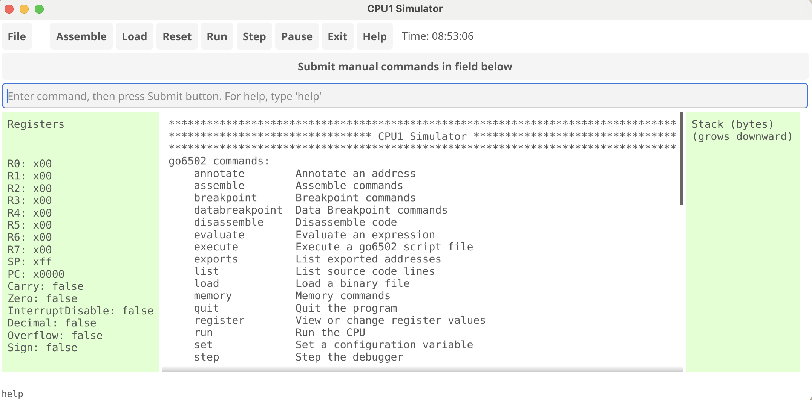
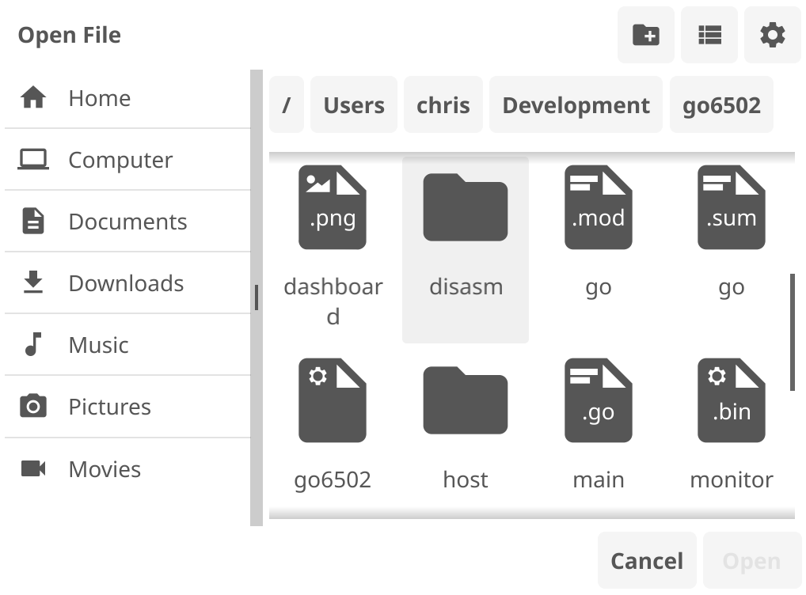

# cpu1-simulator
My first custom CPU simulator. CPU1 is an imaginary 8-bit processor created for educational purposes.

# Introduction

This CPU simulator implements an imaginary 8-bit processor and instruction set. Much of the code is derived from work by Brett Vickers and posted on github [here](https://github.com/beevik/go6502).

# Architecture description

This cpu, called CPU1, has an 8-bit data bus and a 16-bit address bus. It has an accumulator, flag register, and eight 8-bit general purpose registers. There is a 16-bit program counter and an 8-bit stack pointer. The stack is limited in size and always grows downward from $01FF. Programs execute from any address beginning at $0200. Memory addresses are stored Big Endian, with most significant byte at lower address in memory.

### Addressing modes
Mode|Clock cycles|Description
-------|------------|------------------------------------------------------------------------------
**IMM**|   2   |Immediate, operand for instruction is the byte immediately following the opcode
**IMP**|   1   |Implied, operand is three least significant bits of the opcode
**DIR**|   3   |Direct, operand is the two bytes following the opcode

# Instruction Set

### Opcode Keys
Code|Description
-----|------------------------------------------------------------------------------
**V**|value (bits encoding literal value); 
**R**|register (registers are encoded according to the pattern: 0 - R0, 1 - R1, etc.); 
**X**|ignored; 
**M**|memory address; 
**C**|carry bit; 

### Opcodes
Nemonic|Opcode (hex)|Opcode (binary)|    Operand(s)  |    Description
-------|------------|---------------|----------------|--------------------------------------------
ADR|80|10000000|XRRRXRRR|RX <- RX + RY Add rgisters specified by operand lo and hi nibbles
ADI|88,89,8A,8B,8C,8D,8E,8F|10001RRR|VVVVVVVV|R <- R + (PC+1); Add immediate
ADM|90,91,92,93,94,95,96,97|10001RRR|MMMMMMMM MMMMMMMM|R <- R + (M); Add memory at address to R
ADRC|81|10000001|XRRRXRRR|RX <- RX + RY + C; Add registers with carry bit
ADIC|A0,A1,A2,A3,A4,A5,A6,A7|10100RRR|VVVVVVVV|R <- R + (PC+1) + C; Add w/carry immediate
ADMC|A8,A9,AA,AB,AC,AD,AE,AF|10101RRR|MMMMMMMM MMMMMMMM|R <- R + (M) + C; Add w/carry the byte at M
SUB|82|10000010|XRRRXRRR|RX <- RX - RY; Subtract RX from RY. Set carry and negative flags
SUBI|B8,B9,B1,BB,BC,BD,BE,BF|10111RRR|VVVVVVVV|R <- R - (PC+1); Subtract immediate. Set carry and neg flags
SUBM|C0,C1,C2,C3,C4,C5,C6,C7|11000RRR|MMMMMMMM MMMMMMMM|R <- R - (M); Subtract memory. Set carry and neg flags
SUBC|83|1000011|XRRRXRRR|RX <- RX - RY - C - (NOT C); Subtract register w/borrow from carry bit
SUBIC|D0,D1,D2,D3,D4,D5,D6,D7|11010RRR|VVVVVVVV|R <- R - (PC+1) - C - (NOT C); Subtract immediate w/borrow, flags
SUBMC|D8,D9,DA,DB,DC,DD,DE,DF|11011RRR|MMMMMMMM MMMMMMMM|R <- R - (M) - C - (NOT C); Sub immed w/borrow from carry
LDI|E0,E1,E2,E3,E4,E5,E6,E7|11100RRR|VVVVVVVV|R <- (PC+1); Load immediate into R
STI|E8,E9,EA,EB,EC,ED,EE,EF|11101RRR|MMMMMMMM MMMMMMMM|(M) <- R; Store immediate R at M
LDM|F0,F1,F2,F3,F4,F5,F6,F7|11110RRR|MMMMMMMM MMMMMMMM|R <- (M); Load from memory into R
EX|84|10000100|XRRRXRRR|RX <- RY; RY <- RX; Exchange registers
CMP|85|10000100|XRRRXRRR|IF RX=RY,CP=TRUE,ELSE CP=FALSE; Compare registers and set compare flag if equal
AND|86|10000110|XRRRXRRR|RX <-RX AND RY; AND: Logical AND of RX and RY. Result to RX
OR|87|10000111|XRRRXRRR|RX <- RX OR RY; OR: Logical OR of RX and RY. Result to RX
XOR|19|00011001|XRRRXRRR|RX <- RX XOR RY; XPR: Exclusive OR of RX and RY. Result to RX
ANI|50,51,52,53,54,55,56,57|01010RRR|VVVVVVVV|R <- R AND (PC+1); AND immediate. Result to R
ORI|58,59,5A,5B,5C,5D,5E,5F|01011RRR|VVVVVVVV|R <- R OR (PC+1); OR immediate. Result in R
XRI|60,61,62,63,64,65,66,67|01100RRR|VVVVVVVV|R <- R XOR (PC+1); XOR immediate. Result in R
SHR|68,69,6A,6B,6C,6D,6E,6F|01101RRR||R <- R>>1;Shift right reg R by one bit. Fill w/zero on left
SHRC|70,71,72,73,74,75,76,77|01110RRR||R <- R>>1:Shift right reg R by one. Fill left with carry bit
SHL|78,79,7A,7B,7C,7D,7E,7F|01111RRR||R <- R<<1; Shift left reg R one bit. Fill least sig with 0
SHLC|20,21,22,,23,24,25,26,27|00100RRR||R <- R<<1; Shift left reg R one bit, fill lsb with carry bit
INC|28,29,2A,2B,2C,2D,2E,2F|00101RRR||R <- R + 1; Increment reg R by 1
DEC|30,31,32,33,34,35,36,37|00110RRR||R <- R - 1; Decrement reg R by 1
NOP|00|00000000||PC <- PC + 1; Continue to next instruction
HALT|01|00000001||PC <- PC; Stop CPU clock and instruction execution at current PC
SETQ|38,39,3A,3B,3C,3D,3E,3F|00111QQQ||QN <- true(1); Sets specified I/O line to true(1)
RESETQ|10,11,12,13,14,15,16,17|00010QQQ||QN <- false(0); Sets specified I/O liine to false(0)
LBRC|18|00011000|MMMMMMMM MMMMMMMM|If CP=true, PC <- M, else PC <- PC+2;Long branch if compare flag true
LBRQ|08,09,0A,0B,0C,0D,0E,0F|00001QQQ|MMMMMMMM MMMMMMMM|IF QN, PC <- M, else PC <- PC + 2; Long branch if true
PUSH|40,41,42,43,44,45,46,47|01000RRR||SP <- SP-1; (SP) <- R; Push register onto stack
POP|48,49,4A,,4B,4C,4D,4E,4F|01001RRR||R <- (SP); SP <- SP + 1; Pop register from stack
CALL|02|00000010|MMMMMMMM MMMMMMMM|PC <- PC+3,SP <- SP-1;(SP) <- PC; Call subroutine, save PC on stack (Big Endian)
RET|03|00000011||PC.1 <- (SP),SP+1,PC.0 <- (SP), SP+1; Return from subroutine popping PC off stack (Big Endian)


# GUI Dashboard
### Here is a sample of what you will see on the dashboard:


### Pressing the File button opens modal dialog:



# Building the Application
First be sure the latest version of golang is installed.
```
$ sudo rm -rf /usr/local/go && curl -sSL "https://go.dev/dl/go1.22.3.linux-arm64.tar.gz" | sudo tar -xz -C /usr/local
$ echo 'export PATH=$PATH:/usr/local/go/bin' >> $HOME/.profile
$ source $HOME/.profile
$ go version
go version go1.22.3 linux/arm64
```
Clone the github repo for cjr29/cpu1-simulator
```
$ cd cpu1-simulator
$ go mod tidy
$ go build -o .
$ ./cpu1-simulator -g
```

# Tutorial

## Command Line Mode
All instructions described below under command line mode can also be entered via the GUI in the command line field,
then pressing the ***Submit*** button.

Start by considering the go6502 `sample.cmd` script:

```
load monitor.bin $F800
assemble file sample.asm
load sample.bin
reg PC START
d .
```

We'll describe what each of these commands does in greater detail later, but
for now know that they do the following things:
1. Load the `monitor.bin` binary file at memory address `F800`.
2. Assemble the `sample.asm` file using the go6502 cross-assembler, generating
   a `sample.bin` binary file and a `sample.map` source map file.
3. Load the `sample.bin` binary file and its corresponding `sample.map` source
   map file. The binary data is loaded into memory at the origin address
   exported during assembly into the `sample.map` file.
4. Set the program counter register to value of the `START` address, which
   was exported during assembly into the `sample.map` file.
5. Disassemble the first few lines of machine code starting from the program
   counter address.

To run this script, type the following on the command line:

```
go6502 sample.cmd
```

You should then see:

```
Loaded 'monitor.bin' to $F800..$FFFF.
Assembled 'sample.asm' to 'sample.bin'.
Loaded source map from 'sample.bin'.
Loaded 'sample.bin' to $1000..$10FF.
Register PC set to $1000.
Breakpoint added at $1020.
1000-   A2 EE       LDX   #$EE
1002-   A9 05       LDA   #$05
1004-   20 19 10    JSR   $1019
1007-   20 1C 10    JSR   $101C
100A-   20 36 10    JSR   $1036
100D-   20 46 10    JSR   $1046
1010-   F0 06       BEQ   $1018
1012-   A0 3B       LDY   #$3B
1014-   A9 10       LDA   #$10
1016-   A2 56       LDX   #$56

1000-   A2 EE       LDX   #$EE      A=00 X=00 Y=00 PS=[------] SP=FF PC=1000 C=0
*
```

The output shows the result of running each sample script command. Once the
script has finished running, go6502 enters interactive mode and displays a `*`
prompt for further input.

Just before the prompt is a line starting with `1000-`. This line displays the
disassembly of the instruction at the current program counter address and the
state of the CPU registers. The `C` value indicates the number of CPU cycles
that have elapsed since the application started.

## Getting help

Let's enter our first interactive command. Type `help` to see a list of all
commands.

```
go6502 commands:
    annotate         Annotate an address
    assemble         Assemble commands
    breakpoint       Breakpoint commands
    databreakpoint   Data breakpoint commands
    disassemble      Disassemble code
    evaluate         Evaluate an expression
    execute          Execute a go6502 script file
    exports          List exported addresses
    load             Load a binary file
    memory           Memory commands
    quit             Quit the program
    register         View or change register values
    run              Run the CPU
    set              Set a configuration variable
    step             Step the debugger

*
```

To get more information about a command, type `help` followed by the command
name. In some cases, you will be shown a list of subcommands that must be used
with the command. Let's try `help step`.

```
* help step
Step commands:
    in               Step into next instruction
    over             Step over next instruction

*
```

This response indicates that the `step` command has two possible subcommands.
For example, if you wanted to step the CPU into the next instruction, you
would type `step in`.

Now let's get help on the `step in` command.

```
* help step in
Usage: step in [<count>]

Description:
   Step the CPU by a single instruction. If the instruction is a subroutine
   call, step into the subroutine. The number of steps may be specified as an
   option.

Shortcut: si

*
```

Every command has help text like this. Included in the help text is a
description of the command, a list of shortcuts that can be used to invoke the
command, and a usage hint indicating the arguments accepted by the command.
Usage arguments appear inside `<angle-brackets>`. Optional usage arguments
appear inside square `[<brackets>]`.

## Abbreviating commands

The go6502 application uses a "shortest unambiguous match" parser to process
commands. This means that when entering a command, you need only type the
smallest number of characters that uniquely identify it.  For instance,
instead of typing `quit`, you can type `q` since no other commands start with
the letter Q.

Most commands also have shortcuts. To discover a command's shortcuts, use
`help`.

## Stepping the CPU

Let's use one of the `step` commands to step the CPU by a single instruction.
Type `step in`.

```
1000-   A2 EE       LDX   #$EE      A=00 X=00 Y=00 PS=[------] SP=FF PC=1000 C=0
* step in
1002-   A9 05       LDA   #$05      A=00 X=EE Y=00 PS=[N-----] SP=FF PC=1002 C=2
*
```

By typing `step in`, you are telling the emulated CPU to execute the `LDX #$EE`
instruction at address `1000`. This advances the program counter to `1002`,
loads the value `EE` into the X register, and increases the CPU cycle counter
by 2 cycles.

Each time go6502 advances the program counter interactively, it disassembles
and displays the instruction to be executed next. It also displays the current
values of the CPU registers and cycle counter.

The shortcut for the `step in` command is `si`. Let's type `si 4` to step the
CPU by 4 instructions:

```
1002-   A9 05       LDA   #$05      A=00 X=EE Y=00 PS=[N-----] SP=FF PC=1002 C=2
* si 4
1004-   20 19 10    JSR   $1019     A=05 X=EE Y=00 PS=[------] SP=FF PC=1004 C=4
1019-   A9 FF       LDA   #$FF      A=05 X=EE Y=00 PS=[------] SP=FD PC=1019 C=10
101B-   60          RTS             A=FF X=EE Y=00 PS=[N-----] SP=FD PC=101B C=12
1007-   20 1C 10    JSR   $101C     A=FF X=EE Y=00 PS=[N-----] SP=FF PC=1007 C=18
*
```

This output shows that the CPU has stepped the next 4 instructions starting at
address `1002`.  Each executed instruction is disassembled and displayed along
with the CPU's register values at the start of each instruction. In this
example, a total of 18 CPU cycles have elapsed, and the program counter ends
at address `1007`.  The instruction at `1007` is waiting to be executed.

Note that the `step in` command stepped _into_ the `JSR $1019` subroutine call
rather than stepping _over_ it.  If you weren't interested in stepping through
all the code inside the subroutine, you could have used the `step over`
command instead. This would have caused the debugger to invisibly execute all
instructions inside the subroutine, returning the prompt only after the `RTS`
instruction has executed.

Since the CPU is about to execute another `JSR` instruction, let's try the
`step over` command (or `s` for short).

```
1007-   20 1C 10    JSR   $101C     A=FF X=EE Y=00 PS=[N-----] SP=FF PC=1007 C=18
* s
100A-   20 36 10    JSR   $1036     A=00 X=EE Y=00 PS=[-Z----] SP=FF PC=100A C=70
*
```

After stepping over the `JSR` call at address `1007`, all of the instructions
inside the subroutine at `101C` have been executed, and control has returned
at address `100A` after 52 additional CPU cycles have elapsed.

## Another shortcut: Hit Enter!

One shortcut you will probably use frequently is the blank-line short cut.
Whenever you hit the Enter key instead of typing a command, the go6502
application repeats the previously entered command.

Let's try hitting enter twice to repeat the `step over` command two more
times.

```
100A-   20 36 10    JSR   $1036     A=00 X=EE Y=00 PS=[-Z----] SP=FF PC=100A C=70
*
100D-   20 46 10    JSR   $1046     A=00 X=00 Y=00 PS=[-Z----] SP=FF PC=100D C=103
*
1010-   F0 06       BEQ   $1018     A=00 X=00 Y=00 PS=[-Z----] SP=FF PC=1010 C=136
*
```

go6502 has stepped over two more `JSR` instructions, elapsing another 66 CPU
cycles and leaving the program counter at `1010`.

## Disassembling code

Now let's disassemble some code at the current program counter address to get
a preview of the code about to be executed.  To do this, use the `disassemble`
command or its shortcut `d`.

```
* d .
1010-   F0 06       BEQ   $1018
1012-   A0 3B       LDY   #$3B
1014-   A9 10       LDA   #$10
1016-   A2 56       LDX   #$56
1018-   00          BRK
1019-   A9 FF       LDA   #$FF
101B-   60          RTS
101C-   A9 20       LDA   #$20
101E-   A5 20       LDA   $20
1020-   B5 20       LDA   $20,X
*
```

Note the `.` after the `d` command.  This is shorthand for the current program
counter address.  You may also pass an address or mathematical expression to
disassemble code starting from any address:

```
* d START+2
1002-   A9 05       LDA   #$05
1004-   20 19 10    JSR   $1019
1007-   20 1C 10    JSR   $101C
100A-   20 36 10    JSR   $1036
100D-   20 46 10    JSR   $1046
1010-   F0 06       BEQ   $1018
1012-   A0 3B       LDY   #$3B
1014-   A9 10       LDA   #$10
1016-   A2 56       LDX   #$56
1018-   00          BRK
*
```

By default, go6502 disassembles 10 instructions, but you can disassemble a
different number of instructions by specifying a second argument to the
command.

```
* d . 3
1010-   F0 06       BEQ   $1018
1012-   A0 3B       LDY   #$3B
1014-   A9 10       LDA   #$10
*
```

If you hit the Enter key after using a disassemble command, go6502 will
continue disassembling code from where it left off.

```
*
1016-   A2 56       LDX   #$56
1018-   00          BRK
1019-   A9 FF       LDA   #$FF
*
```

If you don't like the number of instructions that go6502 is configured to
disassemble by default, you can change it with the `set` command:

```
* set DisasmLines 20
```

## Annotating code

It's often useful to annotate a line of code with a comment. I use annotations
to leave notes to myself when I'm trying to understand how some piece of
machine code works.

Let's consider again the code loaded by the sample script.

```
* d $1000
1000-   A2 EE       LDX   #$EE
1002-   A9 05       LDA   #$05
1004-   20 19 10    JSR   $1019
1007-   20 1C 10    JSR   $101C
100A-   20 36 10    JSR   $1036
100D-   20 46 10    JSR   $1046
1010-   F0 06       BEQ   $1018
1012-   A0 3B       LDY   #$3B
1014-   A9 10       LDA   #$10
1016-   A2 56       LDX   #$56
*
```

The `JSR` instruction at address `1007` calls a subroutine that uses all
the addressing mode variants of the `LDA` command.  Let's add an annotation
to that line of code to remind ourselves later what its purpose is.

```
* annotate $1007 Use different forms of the LDA command
*
```

Now whenever we disassemble code that includes the instruction at address
`1007`, we will see our annotation.

```
* d $1000
1000-   A2 EE       LDX   #$EE
1002-   A9 05       LDA   #$05
1004-   20 19 10    JSR   $1019
1007-   20 1C 10    JSR   $101C     ; Use different forms of the LDA command
100A-   20 36 10    JSR   $1036
100D-   20 46 10    JSR   $1046
1010-   F0 06       BEQ   $1018
1012-   A0 3B       LDY   #$3B
1014-   A9 10       LDA   #$10
1016-   A2 56       LDX   #$56
*
```

To remove an annotation, use the `annotate` command with an address but
without a description.

## Dumping memory

Another common task is dumping the contents of memory.  To do this, use the
`memory dump` command, or `m` for short.

```
* m $1000
1000- A2 EE A9 05 20 19 10 20   "n). ..
1008- 1C 10 20 36 10 20 46 10   .. 6. F.
1010- F0 06 A0 3B A9 10 A2 56   p. ;)."V
1018- 00 A9 FF 60 A9 20 A5 20   .).`) %
1020- B5 20 A1 20 B1 20 AD 00   5 ! 1 -.
1028- 02 AD 20 00 BD 00 02 B9   .- .=..9
1030- 00 02 8D 00 03 60 A2 20   .....`"
1038- A6 20 B6 20 AE 00 02 AE   & 6 ....
*
```

Memory dumps include hexadecimal and ASCII representations of the dumped
memory, starting from the address you specified. By default, the memory
dump shows 64 bytes, but you can specify a different number of bytes to
dump with a second argument.

```
* m $1000 16
1000- A2 EE A9 05 20 19 10 20   "n). ..
1008- 1C 10 20 36 10 20 46 10   .. 6. F.
*
```

As with the `disassemble` command, you can enter a blank line to continue
dumping memory from where you left off:

```
*
1010- F0 06 A0 3B A9 10 A2 56   p. ;)."V
1018- 00 A9 FF 60 A9 20 A5 20   .).`) %
*
1020- B5 20 A1 20 B1 20 AD 00   5 ! 1 -.
1028- 02 AD 20 00 BD 00 02 B9   .- .=..9
*
```

To change the default number of bytes that are dumped by a `memory dump`
command, use the `set` command:

```
* set MemDumpBytes 128
```

## Modifying memory

To change the contents of memory, use the `memory set` command, or `ms` for
short.

```
* ms 0x800 $5A $59 $58 $57
* m 0x800 4
0800- 5A 59 58 57               ZYXW
*
```

A sequence of memory values must be separated by spaces and may include
simple hexadecimal values like shown in the example above, or mathematical
expressions like in the following:

```
* ms 0x800 12*2 'A' 1<<4 $0F^$05
* m 0x800 4
0800- 18 41 10 0A               .A..
*
```

## Aside: Number formats

go6502 accepts numbers in multiple formats. In most of the examples we've seen
so far, addresses and byte values have been specified in base-16 hexadecimal
format using the `$` prefix.

The following table lists the number-formatting options understood by go6502:

 Prefix   | Format      | Base | Example     | Comment
----------|-------------|:----:|-------------|-------------------------
 _(none)_ | Decimal     | 10   | -151        | See note about hex mode.
 `$`      | Hexadecimal | 16   | `$FDED`     |
 `0x`     | Hexadecimal | 16   | `0xfded`    |
 `%`      | Binary      | 2    | `%01011010` |
 `0b`     | Binary      | 2    | `0b01011010`|
 `0d`     | Decimal     | 10   | `0d128`     | Useful in hex mode.

If you prefer to work primarily with hexadecimal numbers, you can change the
"hex mode" setting using the `set` command.

```
* set HexMode true
```

In hex mode, numeric values entered without a prefix are interpreted as
hexadecimal values. However, because hexadecimal numbers include the letters
`A` through `F`, the interpreter is unable to distinguish between a number and
an identifier. So identifiers are not allowed when interpreting expressions in
hex mode.


## Inspecting and changing registers

The 6502 registers can be inspected using the `register` command, or `r`
for short.

```
* r
1000-   A2 EE       LDX   #$EE      A=00 X=00 Y=00 PS=[------] SP=FF PC=1000 C=0
*
```

If you wish to change a register value, simply add additional arguments.

```
* r A $80
Register A set to $80.
1000-   A2 EE       LDX   #$EE      A=80 X=00 Y=00 PS=[------] SP=FF PC=1000 C=0
*
```

Registers you can change this way include `A`, `X`, `Y`, `PC` and `SP`.

You can also change the CPU's status flags. Simply provide one of the flag
names (`N`, `Z`, `C`, `I`, `D` or `V`) instead of a register name.

```
* r Z 1
Status flag ZERO set to true.
1000-   A2 EE       LDX   #$EE      A=80 X=00 Y=00 PS=[-Z----] SP=FF PC=1000 C=0
* r Z 0
Status flag ZERO set to false.
1000-   A2 EE       LDX   #$EE      A=80 X=00 Y=00 PS=[------] SP=FF PC=1000 C=0
*
```

Further info about the `register` command can be found by typing
`help register`.


## Evaluating expressions

Sometimes it's useful to have a calculator on hand to compute the result of a
simple math expression. go6502 has a built-in expression evaluator in the form
of the `evaluate` command, or `e` for short. The evaluator understands most C
expression operators.

```
* e 1<<4
$0010
* e ($FF ^ $AA) | $0100
$0155
* e ('A' + 0x20) | 0x80
$00E1
* e 0b11100101
$00E5
* e -151
$FF69
```

Because go6502 is written for an 8-bit CPU with a 16-bit address space, the
results of all evaluations are displayed as 16-bit values.


## Assembling source code

go6502 has a built-in cross-assembler. To assemble a file on disk into a raw
binary file containing 6502 machine code, use the `assemble file` command (or
`a` for short).

```
* a sample.asm
Assembled 'sample.asm' to 'sample.bin'.
```

The `assemble file` command loads the specified source file, assembles it, and
if successful outputs a raw `.bin` file containing the machine code into the
same directory.  It also produces a `.map` source map file, which is used to
store (1) the "origin" memory address the machine code should be loaded at,
(2) a list of exported address identifiers, and (3) a mapping between source
code lines and memory addresses.

Once assembled, the binary file and its associated source map can be loaded
into memory using the `load` command.

```
* load sample.bin
Loaded source map from 'sample.map'.
Loaded 'sample.bin' to $1000..$10FF.
```

